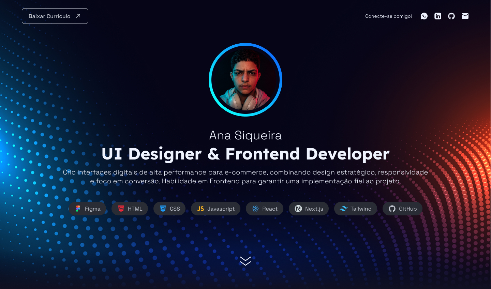

# Portfolio

Meu portfólio desenvolvido com Next.js, React e Tailwind CSS para apresentar projetos de UI Design e Frontend Development.



## ✨ Sobre

Este projeto foi desenvolvido com foco em performance, acessibilidade e responsividade, reunindo alguns dos principais projetos da minha atuação como UI Designer e Frontend Developer.

O objetivo é apresentar estudos de caso completos, mostrando desde o processo de design até a implementação das interfaces.

## 💡 O que foi praticado

- Componentização
- Organização de dados com TypeScript
- Responsividade Mobile First
- Motion para animações
- SEO com Metadata API
- Otimização de imagens
- Estrutura escalável de componentes

## 🚀 Tecnologias

- Next.js 16
- React 19
- TypeScript
- Tailwind CSS 4
- Motion
- ESLint

## 📂 Estrutura

```text
src
├── app
├── components
├── data
├── types
└── public
```

## 📱 Funcionalidades

- Layout totalmente responsivo
- Animações com Motion
- SEO otimizado
- Componentização com React
- Otimização de imagens com Next.js
- Cases organizados por estrutura de dados
- Performance otimizada

## 📸 Projetos apresentados

- Coach Brasil
- Shop2Gether
- Wake

## 🎨 Design

Todo o layout foi desenvolvido no Figma antes da implementação em código.

## 👋 Contato

LinkedIn: https://www.linkedin.com/in/ana-siqueira-247940125/

GitHub: https://github.com/itsmesiq

Email: anasiqueira.serpentis@gmail.com


## ⚙️ Como executar

Clone o repositório:

```bash
git clone https://github.com/itsmesiq/portfolio.git
```

Entre na pasta:

```bash
cd portfolio
```

Instale as dependências:

```bash
pnpm install
```

Execute o projeto:

```bash
pnpm dev
```

Abra:

```
http://localhost:3000
```


## 📄 Licença

Este projeto foi desenvolvido para fins de portfólio.